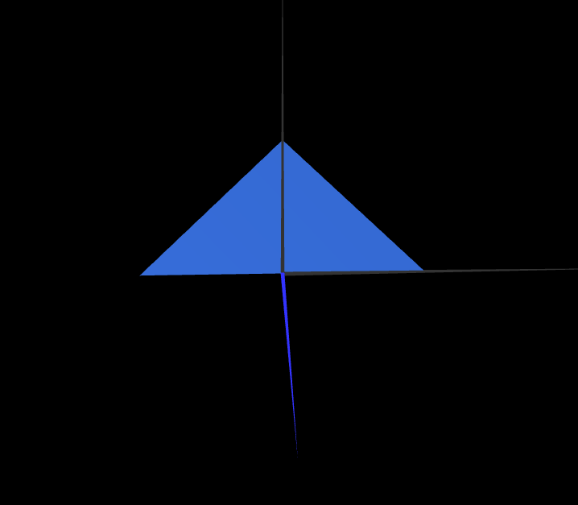
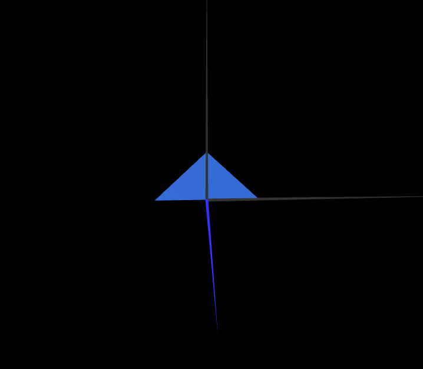

# CG 2024/2025

## Group T11G01

## TP 1 Notes

- In exercise 1 we had some problems understanding how to create a double sized shape. After clearing our doubts with the teacher we were able to conclude the exercise
- In exercise 2 we were more comfortable with producing both of the shapes without any significant problems.

