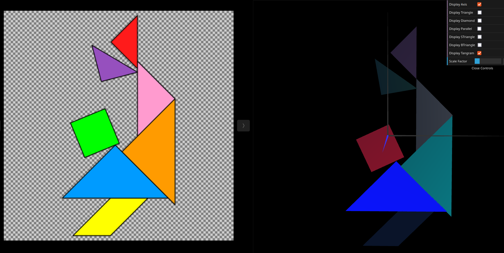
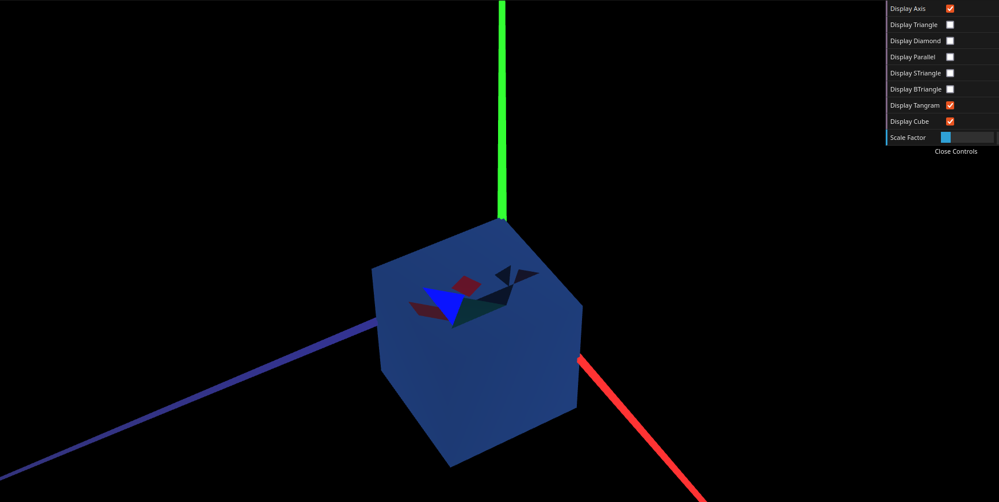

# CG 2024/2025

## Group T11G01

## TP 1 Notes

<!-- - In exercise 1 we had some problems understanding how to create a double sized shape. After clearing our doubts with the teacher we were able to conclude the exercise
- In exercise 2 we were more comfortable with producing both of the shapes without any significant problems.

 -->
- There were some struggles in terms of the position of the different elements in exercise 1 but after sometime it was successfully done.
- Exercise 2 was the one that took the most amount of time because of its repetitiveness.
- The easiest of them all was exercise 3. With the concepts showed in the previous exercises, it was pretty straight forward.

