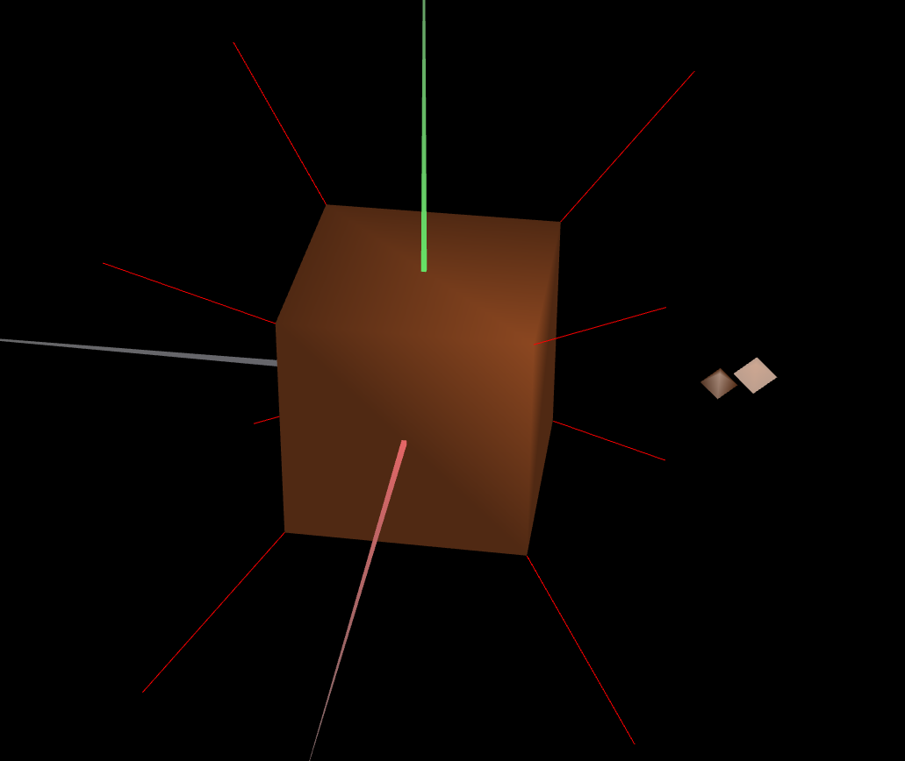
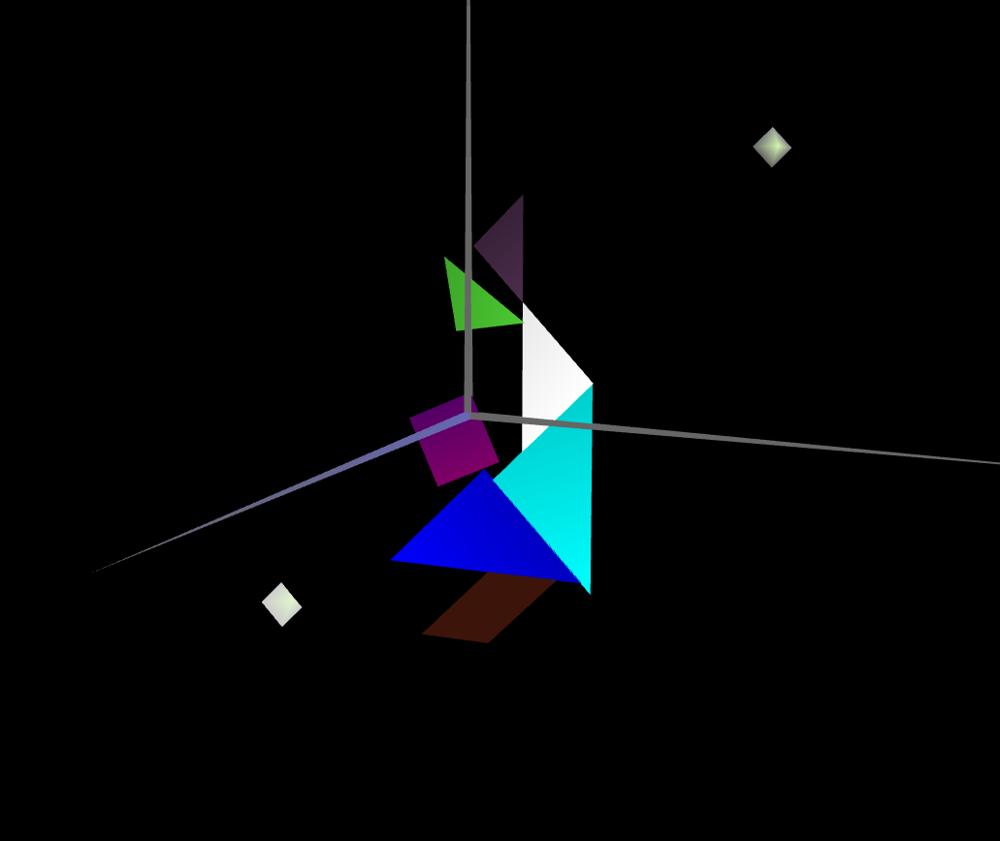
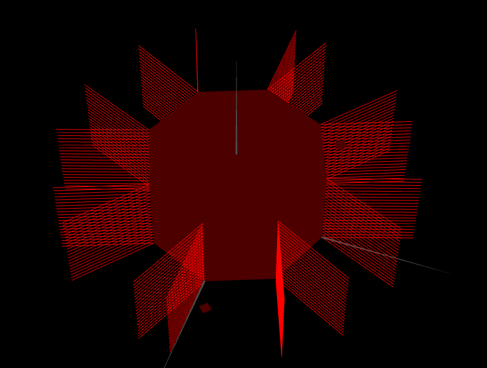

# CG 2024/2025

## Group T11G01

## TP 1 Notes

- Task 1: The prompt was a bit confusing but I hope the presented solution is the right one
- Task 2: Apllying the materials was really simple.
- Task 3: This took a really long time as the instructions were not very clear and we also spent a lot of time calculating the angles for the prism

