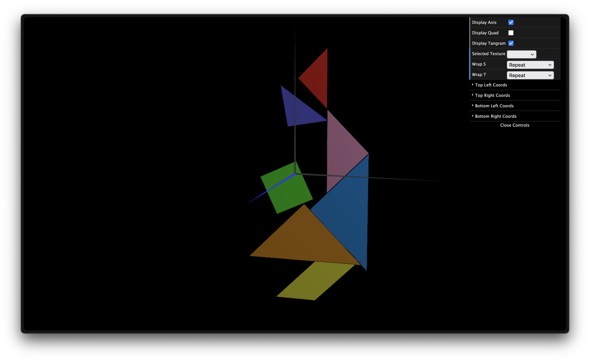

# CG 2024/2025

## Group T11G01

## TP 4 Notes

- The first part was the most difficult, as the measurings from the coordinates were not clear. The biggest struggle was definetly matching the correct vertices from our program to the ones in the texture image.
- The second part was easier, although we had to change the unit's cube translations and rotations to match the new quad.

