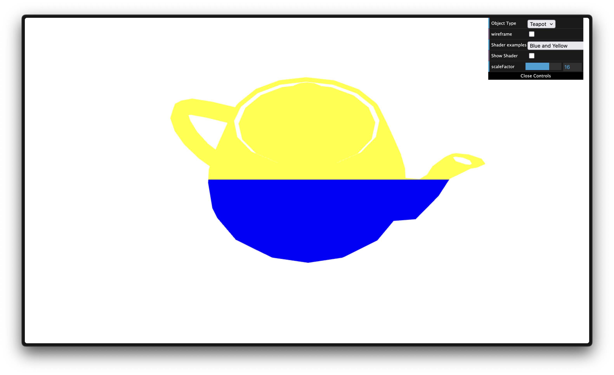
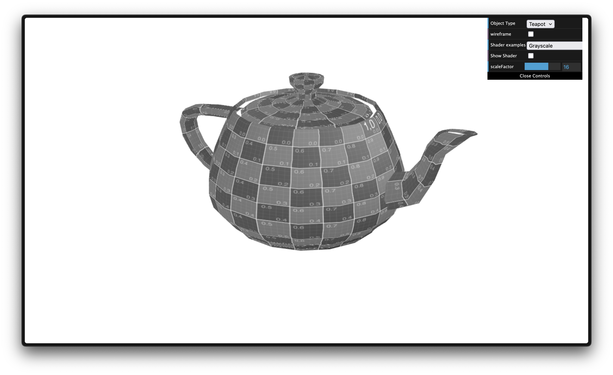
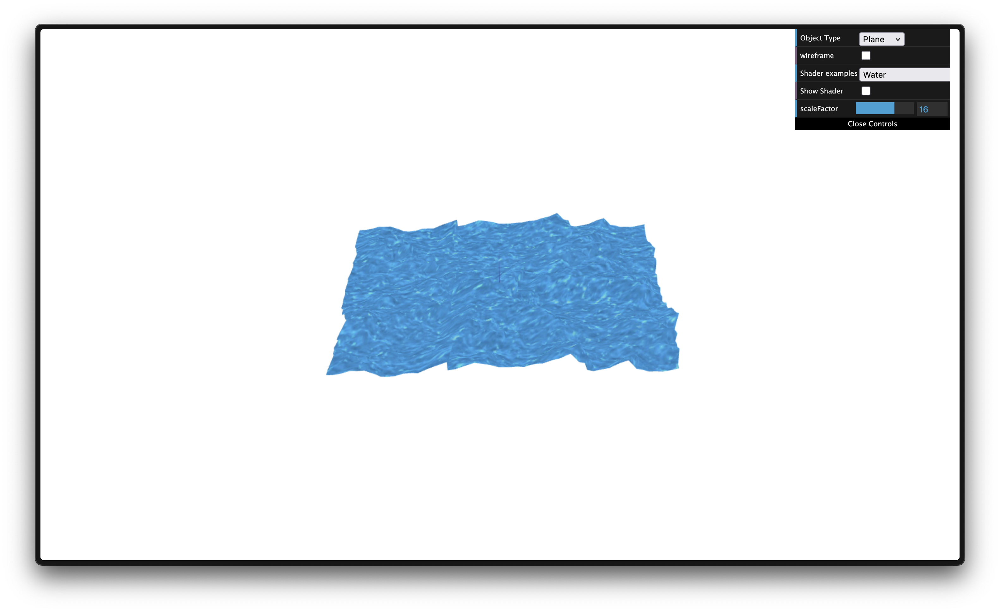

# CG 2024/2025

## Group T11G01

## TP 5 Notes

- The biggest struggle of the first exercise was understanding how variables connect from shader to fragment. After understanding it, the second exercise was trivial.
- The third exercise was difficult in a way that we did not knew that we had to change/add code to ShaderScene regarding timeFactor. We also faced some undesired spikes in the water scene, which were resolved through some scalars multiplications

